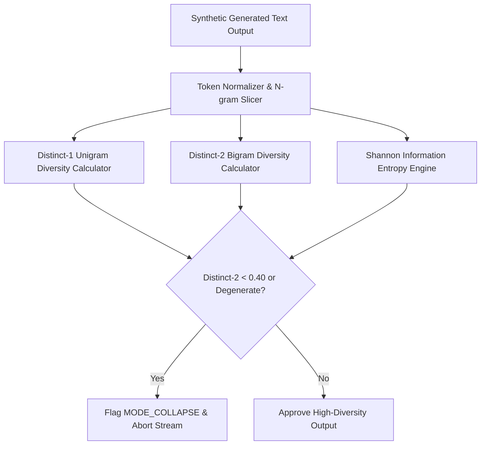

# GenPark AI Agent Skill - Synthetic Text N-gram Diversity & Entropy Scorer

Computes Distinct-1/2/3 ratios and Shannon word entropy to detect generative model mode collapse and degenerative repetition loops.

Verified by [GenPark AI](https://genpark.ai) and compatible with [Model Context Protocol (MCP)](https://genpark.ai/mcp).

## Architecture Diagram

## Features
- **Mode Collapse Tripwire**: Detects degenerate token repeating loops (`hello world hello world...`).
- **Zero External Dependencies**: Pure Python standard library `collections` and `math`.
